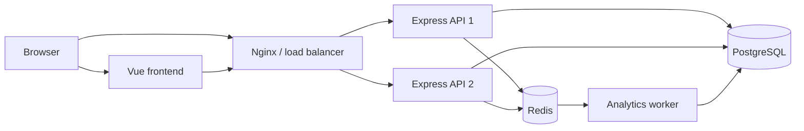

# URL Shortener

A URL shortening application with a user dashboard and basic click analytics.
Links can be created anonymously or while signed in. Links created by signed-in
users are displayed in their dashboard together with click counts.

The project is a `pnpm`-managed monorepo consisting of a Vue application and an
Express API.

## Key Features

- generation of unique six-character Base62 codes,
- fast redirects using a Redis cache,
- registration and sign-in with Better Auth,
- user dashboard listing created links,
- asynchronous collection and hourly aggregation of click statistics,
- shared Redis-backed rate limiting,
- ready-to-use Docker Compose configuration with Nginx and two API instances.

## Technology Stack

| Layer           | Technologies                                 |
| --------------- | -------------------------------------------- |
| Frontend        | Vue 3, Vite, TypeScript, Vue Router, Nuxt UI |
| Backend         | Node.js, Express 5, TypeScript, Zod          |
| Authentication  | Better Auth                                  |
| Database        | PostgreSQL, Drizzle ORM                      |
| Cache and queue | Redis, Redis Streams                         |
| Infrastructure  | Docker Compose, Nginx                        |
| Tests           | Vitest                                       |

## Architecture



### Responsibilities

- `apps/frontend/` provides the shortening form, sign-in, registration, and
  user dashboard.
- `apps/backend/src/modules/urls/` handles link creation, code generation,
  redirects, caching, and retrieving user links.
- `apps/backend/src/modules/analytics/` creates click events and aggregates
  them by hour, country, device, and referrer domain.
- `apps/backend/src/workers/analytics.worker.ts` consumes events from Redis
  Streams and writes aggregates to PostgreSQL.
- PostgreSQL is the source of truth for links, users, and statistics.
- Redis stores the redirect cache, rate limiter counters, and analytics event
  stream.
- Nginx distributes traffic between two stateless API instances.

## Main Flows

### Creating a Shortened Link

1. The frontend sends `POST /api/create-url` with the long URL.
2. The API validates the URL with Zod and checks the shared Redis rate limit.
3. PostgreSQL returns the next value from the `short_code_counter` sequence.
4. The value is encoded as Base62 and left-padded with zeros to six characters.
5. The code, long URL, and optional user ID are saved in the `urls` table.
6. The API returns the public shortened URL.

A new link is not immediately added to the cache. It is stored in Redis only
after its first use.

### Redirect

1. The client requests `GET /:code`.
2. The API looks for the code in Redis under the `url:<code>` key.
3. On a cache miss, the API retrieves the link from PostgreSQL, checks its
   expiration date, and caches the result for up to one hour.
4. The API returns an HTTP redirect to the long URL.
5. A click event is asynchronously published to Redis Streams without blocking
   the redirect.

### Click Analytics

Each click receives a random `eventId` and contains the link ID, timestamp,
country, device type, and referrer domain. The worker retrieves events in
batches using a Redis Streams consumer group.

Event processing takes place in a transaction:

1. The `eventId` is inserted into the `processed_click_events` table.
2. Duplicate events are skipped, making processing idempotent.
3. The counter in `click_analytics_hourly` is created or incremented.
4. Invalid events are sent to a separate dead-letter stream.

## Short Code Generation

Codes are not random. Each code is generated from the next integer returned by
a PostgreSQL sequence:

```text
1  -> 1      -> 000001
61 -> Z      -> 00000Z
62 -> 10     -> 000010
```

The Base62 algorithm uses the following alphabet:

```text
0123456789abcdefghijklmnopqrstuvwxyzABCDEFGHIJKLMNOPQRSTUVWXYZ
```

Each number is repeatedly divided by `62`, and the resulting remainders form
its Base62 representation. The result is left-padded with `0` characters to a
length of six. Uniqueness is guaranteed by the PostgreSQL sequence and a unique
index on the `shortCode` column.

Six characters provide `62^6`, or `56,800,235,584`, possible combinations,
including `000000`. The current implementation starts at `000001`, so it can
actually use at most `62^6 - 1` codes. The sequence also allows the value
`62^6`, which the generator cannot represent using six characters. Before
reaching the limit, the sequence maximum must be corrected or the code length
must be increased.

### Advantages of the Current Approach

- no collisions or code generation retries,
- simple and fast algorithm,
- safe code generation across multiple API instances,
- very large code space while keeping URLs short.

### Disadvantages of the Current Approach

- codes are predictable and allow enumeration of existing links,
- creating every link requires contacting the primary database,
- exposed sequence values can approximate the number of created links,
- code length is fixed at six characters.

## Data Model

The main tables are:

- `urls` - long URL, short code, owner, and optional expiration date,
- `user`, `session`, `account`, `verification` - Better Auth data,
- `click_analytics_hourly` - aggregated click counters,
- `processed_click_events` - processed event IDs, deleted after seven days.

## Local Development

Requirements:

- Node.js 24,
- pnpm 11,
- Docker with Docker Compose.

```bash
pnpm install
cp .env.example .env
docker compose up -d
pnpm --filter @url-shortener/backend db:migrate
```

Run the API, analytics worker, and frontend in separate terminals:

```bash
pnpm dev:backend
pnpm --filter @url-shortener/backend analytics:dev
pnpm dev:frontend
```

By default, the frontend runs at `http://localhost:5173` and the API at
`http://localhost:3000`.

Before using authentication, set a strong `BETTER_AUTH_SECRET` value in `.env`.

## API Endpoints

| Method  | Path              | Description                               |
| ------- | ----------------- | ----------------------------------------- |
| `GET`   | `/health`         | Returns the API health status             |
| `POST`  | `/api/create-url` | Creates a shortened link                  |
| `GET`   | `/api/urls`       | Returns links owned by the signed-in user |
| `GET`   | `/:code`          | Redirects to the long URL                 |
| various | `/api/auth/*`     | Better Auth endpoints                     |

## Scaling Challenges and Possible Solutions

### 1. PostgreSQL on the Link Creation Critical Path

Creating every link retrieves a single sequence value and writes to PostgreSQL.
The sequence works correctly across multiple instances, but a single database
becomes a performance bottleneck and a single point of failure.

Possible solutions:

- use managed PostgreSQL with replication, automatic failover, and connection
  pooling,
- allocate ID ranges to instances instead of retrieving each value separately,
- use a distributed ID generator and encode its output as Base62,
- partition data and distribute write traffic when a single cluster is no
  longer sufficient.

### 2. Predictable Codes and Link Enumeration

Sequential codes make neighboring URLs easy to guess. This is a problem if
users treat an unlisted link as a security mechanism.

Possible solutions:

- permute the identifier before encoding it using a reversible algorithm and a
  secret key,
- use cryptographically random codes and handle rare collisions,
- increase the code length and add password protection or access control.

### 3. Cache Misses and Database Overload

A popular link is usually served from Redis, but cache expiration or a cache
restart can cause many concurrent PostgreSQL queries. Nonexistent codes are not
cached, so large-scale requests for invalid codes also put load on the
database.

Possible solutions:

- add negative caching for nonexistent codes,
- use a single-flight mechanism or locking when refreshing a popular entry,
- add random jitter to TTL values so many entries do not expire at once,
- add read replicas or a distributed key-value store for redirects.

### 4. Redis as a Single Point of Failure

The API requires a Redis connection during startup. Redis handles caching, rate
limiting, and the analytics queue, so its failure affects several features at
once.

Possible solutions:

- run Redis Sentinel or managed Redis with replication and failover,
- separate caching, rate limiting, and streams into dedicated clusters,
- allow redirects to work without cache through a controlled PostgreSQL
  fallback,
- add timeouts, a circuit breaker, and latency monitoring.

### 5. Analytics Durability and Throughput

The click stream is trimmed to approximately `100,000` entries. If the worker
is slow or unavailable, unprocessed events can be lost. Additionally, a very
popular link causes frequent updates to the same aggregate row, leading to
write contention.

Possible solutions:

- run multiple workers in the same consumer group,
- add the worker as a service in the production Docker Compose configuration,
- monitor stream length, pending entries, and the dead-letter stream,
- increase retention or use a durable broker such as Kafka,
- aggregate clicks in memory or Redis and periodically write larger batches to
  PostgreSQL,
- partition the analytics table by time.

### 6. Growing User Dashboard Queries

The `/api/urls` endpoint retrieves every link owned by a user and calculates
the click total by joining the analytics table. Query cost grows with the
number of links and analytics dimensions.

Possible solutions:

- add cursor-based pagination,
- maintain a separate total click counter for each link,
- move heavier reports to a dedicated analytics store,
- limit the time range and returned columns.

### 7. Security and Abuse

A public URL shortener can be used to distribute phishing pages, malicious
URLs, and spam. Rate limiting alone does not solve this problem.

Possible solutions:

- check domain and URL reputation during link creation,
- block dangerous hosts, private IP addresses, and unsupported schemes,
- add reporting, moderation, and the ability to quickly disable links,
- apply limits per account, IP, and network range, and add bot protection.
