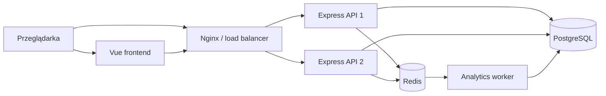

# URL Shortener

Aplikacja do skracania adresów URL z panelem użytkownika i podstawową
analityką kliknięć. Link można utworzyć anonimowo lub po zalogowaniu. Linki
utworzone przez zalogowanego użytkownika są widoczne w jego panelu wraz z
liczbą kliknięć.

Projekt jest monorepo zarządzanym przez `pnpm` i składa się z aplikacji Vue
oraz API Express.

## Najważniejsze funkcje

- generowanie unikalnych, sześcioznakowych kodów Base62,
- szybkie przekierowania z wykorzystaniem cache Redis,
- rejestracja i logowanie przez Better Auth,
- panel użytkownika z listą utworzonych linków,
- asynchroniczne zbieranie i godzinowa agregacja statystyk kliknięć,
- współdzielony rate limiting oparty na Redis,
- gotowa konfiguracja Docker Compose z Nginx i dwiema instancjami API.

## Stos technologiczny

| Warstwa          | Technologie                                  |
| ---------------- | -------------------------------------------- |
| Frontend         | Vue 3, Vite, TypeScript, Vue Router, Nuxt UI |
| Backend          | Node.js, Express 5, TypeScript, Zod          |
| Uwierzytelnianie | Better Auth                                  |
| Baza danych      | PostgreSQL, Drizzle ORM                      |
| Cache i kolejka  | Redis, Redis Streams                         |
| Infrastruktura   | Docker Compose, Nginx                        |
| Testy            | Vitest                                       |

## Architektura



### Podział odpowiedzialności

- `apps/frontend/` odpowiada za formularz skracania, logowanie, rejestrację i
  panel użytkownika.
- `apps/backend/src/modules/urls/` obsługuje tworzenie linków, generowanie
  kodów, przekierowania, cache i pobieranie linków użytkownika.
- `apps/backend/src/modules/analytics/` tworzy zdarzenia kliknięć i agreguje
  je według godziny, kraju, urządzenia oraz domeny odsyłającej.
- `apps/backend/src/workers/analytics.worker.ts` konsumuje zdarzenia z Redis
  Streams i zapisuje agregaty w PostgreSQL.
- PostgreSQL jest źródłem prawdy dla linków, użytkowników i statystyk.
- Redis przechowuje cache przekierowań, liczniki rate limitera oraz strumień
  zdarzeń analitycznych.
- Nginx rozdziela ruch pomiędzy dwie instancje bezstanowego API.

## Główne przepływy

### Tworzenie skróconego linku

1. Frontend wysyła `POST /api/create-url` z długim adresem.
2. API waliduje adres przez Zod i sprawdza współdzielony rate limit w Redis.
3. PostgreSQL zwraca następną wartość sekwencji `short_code_counter`.
4. Wartość jest kodowana do Base62 i dopełniana zerami do sześciu znaków.
5. Kod, długi adres i opcjonalny identyfikator użytkownika są zapisywane w
   tabeli `urls`.
6. API zwraca publiczny skrócony adres.

Nowy link nie trafia od razu do cache. Zostanie zapisany w Redis dopiero przy
pierwszym użyciu.

### Przekierowanie

1. Klient wywołuje `GET /:code`.
2. API szuka kodu w Redis pod kluczem `url:<code>`.
3. Przy braku wpisu API pobiera link z PostgreSQL, sprawdza jego datę
   wygaśnięcia i zapisuje wynik w cache na maksymalnie godzinę.
4. API zwraca przekierowanie HTTP do długiego adresu.
5. Zdarzenie kliknięcia jest publikowane asynchronicznie do Redis Streams, bez
   blokowania przekierowania.

### Analityka kliknięć

Każde kliknięcie otrzymuje losowy `eventId` i zawiera identyfikator linku,
czas, kraj, typ urządzenia oraz domenę odsyłającą. Worker pobiera zdarzenia w
partiach z grupy konsumentów Redis Streams.

Przetwarzanie zdarzenia odbywa się w transakcji:

1. `eventId` jest dodawane do tabeli `processed_click_events`.
2. Powtórzone zdarzenie jest pomijane, dzięki czemu przetwarzanie jest
   idempotentne.
3. Licznik w `click_analytics_hourly` jest tworzony lub zwiększany.
4. Błędne zdarzenia trafiają do osobnego dead-letter stream.

## Generowanie krótkich kodów

Kody nie są losowe. Każdy kod powstaje z kolejnej liczby całkowitej zwracanej
przez sekwencję PostgreSQL:

```text
1  -> 1      -> 000001
61 -> Z      -> 00000Z
62 -> 10     -> 000010
```

Algorytm Base62 używa alfabetu:

```text
0123456789abcdefghijklmnopqrstuvwxyzABCDEFGHIJKLMNOPQRSTUVWXYZ
```

Każda liczba jest dzielona przez `62`, a kolejne reszty tworzą reprezentację
Base62. Wynik jest dopełniany znakami `0` z lewej strony do długości sześciu
znaków. Unikalność zapewniają sekwencja PostgreSQL oraz unikalny indeks na
kolumnie `shortCode`.

Sześć znaków daje `62^6`, czyli `56 800 235 584` możliwych kombinacji,
licząc również `000000`. Obecna implementacja zaczyna od `000001`, więc
faktycznie wykorzystuje maksymalnie `62^6 - 1` kodów. Sekwencja dopuszcza
jeszcze wartość `62^6`, której generator nie potrafi zapisać w sześciu
znakach. Przed dojściem do limitu należy poprawić maksymalną wartość sekwencji
albo zwiększyć długość kodu.

### Zalety obecnego podejścia

- brak kolizji i ponawiania losowania kodu,
- prosty i szybki algorytm,
- bezpieczne generowanie kodów przez wiele instancji API,
- bardzo duża przestrzeń kodów przy krótkim adresie.

### Wady obecnego podejścia

- kody są przewidywalne i umożliwiają enumerację istniejących linków,
- tworzenie każdego linku wymaga kontaktu z główną bazą danych,
- ujawniona liczba może przybliżać liczbę utworzonych linków,
- długość kodu jest ograniczona na stałe do sześciu znaków.

## Model danych

Najważniejsze tabele:

- `urls` - długi URL, krótki kod, właściciel i opcjonalna data wygaśnięcia,
- `user`, `session`, `account`, `verification` - dane Better Auth,
- `click_analytics_hourly` - zagregowane liczniki kliknięć,
- `processed_click_events` - identyfikatory przetworzonych zdarzeń, usuwane po
  siedmiu dniach.

## Uruchomienie lokalne

Wymagania:

- Node.js 24,
- pnpm 11,
- Docker z Docker Compose.

```bash
pnpm install
cp .env.example .env
docker compose up -d
pnpm --filter @url-shortener/backend db:migrate
```

Uruchom API, worker analityki i frontend w osobnych terminalach:

```bash
pnpm dev:backend
pnpm --filter @url-shortener/backend analytics:dev
pnpm dev:frontend
```

Domyślnie frontend działa pod `http://localhost:5173`, a API pod
`http://localhost:3000`.

Przed uruchomieniem logowania ustaw w `.env` silną wartość
`BETTER_AUTH_SECRET`.

## Endpointy API

| Metoda | Ścieżka           | Opis                                  |
| ------ | ----------------- | ------------------------------------- |
| `GET`  | `/health`         | Stan API                              |
| `POST` | `/api/create-url` | Tworzy skrócony link                  |
| `GET`  | `/api/urls`       | Zwraca linki zalogowanego użytkownika |
| `GET`  | `/:code`          | Przekierowuje do długiego adresu      |
| różne  | `/api/auth/*`     | Endpointy Better Auth                 |

## Problemy przy większej skali i możliwe rozwiązania

### 1. PostgreSQL na krytycznej ścieżce tworzenia linku

Każde utworzenie linku pobiera pojedynczą wartość sekwencji i wykonuje zapis w
PostgreSQL. Sekwencja działa poprawnie przy wielu instancjach, ale jedna baza
staje się ograniczeniem wydajności i pojedynczym punktem awarii.

Możliwe rozwiązania:

- użyć zarządzanego PostgreSQL z replikacją, automatycznym failoverem i
  poolingiem połączeń,
- przydzielać instancjom zakresy identyfikatorów zamiast pobierać każdą
  wartość osobno,
- użyć rozproszonego generatora identyfikatorów, a następnie kodować jego wynik
  do Base62,
- partycjonować dane i rozdzielać ruch zapisu, gdy pojedynczy klaster przestaje
  wystarczać.

### 2. Przewidywalne kody i enumeracja linków

Sekwencyjne kody pozwalają łatwo odgadywać sąsiednie adresy. Jest to problem,
jeśli użytkownicy traktują niepubliczny link jako zabezpieczenie.

Możliwe rozwiązania:

- permutować identyfikator przed kodowaniem przy użyciu algorytmu odwracalnego
  i tajnego klucza,
- używać kryptograficznie losowych kodów oraz obsługiwać rzadkie kolizje,
- wydłużyć kod i dodać możliwość ochrony linku hasłem lub kontroli dostępu.

### 3. Cache miss i przeciążenie bazy

Popularny link zwykle jest obsługiwany z Redis, ale wygaśnięcie wpisu lub
restart cache może spowodować wiele równoległych zapytań do PostgreSQL.
Nieistniejące kody nie są cachowane, więc masowe odpytywanie błędnych kodów
również obciąża bazę.

Możliwe rozwiązania:

- dodać cache negatywny dla nieistniejących kodów,
- stosować mechanizm single-flight lub blokadę przy odświeżaniu popularnego
  wpisu,
- losowo rozpraszać TTL, aby wiele wpisów nie wygasało jednocześnie,
- dodać repliki tylko do odczytu lub rozproszony magazyn key-value dla
  przekierowań.

### 4. Redis jako pojedynczy punkt awarii

API wymaga połączenia z Redis podczas startu. Redis obsługuje cache, rate
limiting i kolejkę analityki, więc jego awaria wpływa na kilka funkcji
jednocześnie.

Możliwe rozwiązania:

- uruchomić Redis Sentinel lub zarządzany Redis z replikacją i failoverem,
- rozdzielić cache, rate limiting i strumienie na osobne klastry,
- pozwolić przekierowaniom działać bez cache przez kontrolowany fallback do
  PostgreSQL,
- dodać timeouty, circuit breaker i monitoring opóźnień.

### 5. Trwałość i przepustowość analityki

Strumień kliknięć jest przycinany do około `100 000` wpisów. Przy wolnym lub
wyłączonym workerze nieprzetworzone zdarzenia mogą zostać utracone. Dodatkowo
bardzo popularny link powoduje częste aktualizacje tego samego wiersza
agregatu, co prowadzi do rywalizacji o zapis.

Możliwe rozwiązania:

- uruchamiać wiele workerów w tej samej grupie konsumentów,
- dodać worker jako usługę w produkcyjnym Docker Compose,
- monitorować długość strumienia, pending entries i dead-letter stream,
- zwiększyć retencję albo użyć trwałego brokera, na przykład Kafka,
- agregować kliknięcia w pamięci lub w Redis i okresowo zapisywać większe
  partie do PostgreSQL,
- partycjonować tabelę analityki po czasie.

### 6. Rosnące zapytania panelu użytkownika

Endpoint `/api/urls` pobiera wszystkie linki użytkownika i oblicza sumę
kliknięć przez połączenie z tabelą analityki. Koszt zapytania rośnie wraz z
liczbą linków i wymiarów statystyk.

Możliwe rozwiązania:

- dodać paginację kursorową,
- utrzymywać osobny łączny licznik kliknięć dla każdego linku,
- przenieść cięższe raporty do osobnego magazynu analitycznego,
- ograniczać zakres czasu i zwracane kolumny.

### 7. Bezpieczeństwo i nadużycia

Publiczny skracacz może służyć do rozpowszechniania phishingu, złośliwych
adresów i spamu. Sam rate limit nie rozwiązuje tego problemu.

Możliwe rozwiązania:

- sprawdzać reputację domen i adresów przy tworzeniu linku,
- blokować niebezpieczne hosty, prywatne adresy IP i niedozwolone schematy,
- dodać system zgłoszeń, moderację oraz możliwość szybkiego wyłączenia linku,
- stosować limity per konto, IP i zakres sieci oraz ochronę przed botami.
